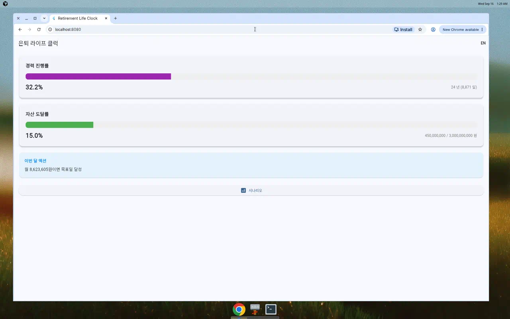
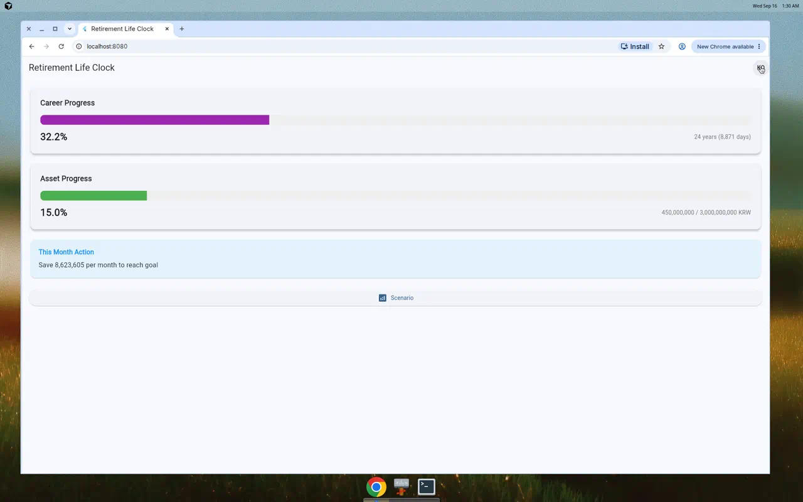
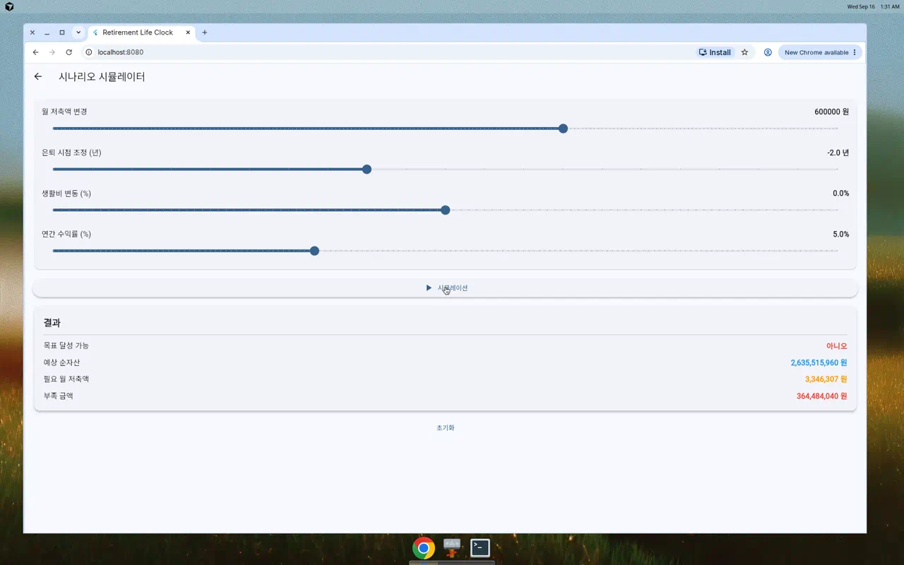

# Retirement Life Clock - MVP Prototype

은퇴 계획 추적 앱: 첫 근무일부터 은퇴 목표일까지의 경력 진행률과 자산 도달률을 한 화면에서 확인하고, 시나리오 시뮬레이터로 월 저축액 및 은퇴 시점 조정 효과를 미리 볼 수 있는 웹/모바일 앱입니다.

## 프로젝트 구조

```
retirement-life-clock/
├── server/                 # Node.js Express 서버
│   ├── index.js           # 메인 서버 파일
│   └── package.json       # 서버 의존성
├── app/                   # Flutter 클라이언트
│   ├── lib/
│   │   ├── main.dart     # 앱 진입점
│   │   ├── models/       # 데이터 모델 (RetirementPlan, SimulationResult)
│   │   ├── services/     # API 및 스토리지 서비스
│   │   ├── l10n/         # 다국어 지원 (한국어/영어)
│   │   └── screens/      # UI 화면들
│   └── pubspec.yaml      # Flutter 의존성
├── artifacts/            # 스크린샷
└── README.md            # 이 문서
```

## 기술 스택

- **클라이언트**: Flutter 3.24.3 (웹 지원, Android/iOS 호환 코드베이스)
- **서버**: Node.js + Express
- **다국어**: 한국어(기본), 영어 (앱 내 토글)
- **상태 관리**: Provider
- **로컬 저장소**: shared_preferences
- **서버 저장소**: 인메모리 Map (프로토타입용)

## 실행 방법

### 1. 서버 실행

```bash
cd server
npm install
npm start
```

서버는 `http://localhost:3000`에서 실행됩니다.

**서버 엔드포인트:**
- `GET /health` - 헬스 체크
- `POST /api/plans` - 은퇴 계획 생성/업데이트
- `GET /api/plans/:id` - 특정 계획 조회
- `GET /api/plans` - 모든 계획 조회
- `POST /api/plans/:id/simulate` - 시나리오 시뮬레이션

**시드 데이터:** 서버는 시작 시 `demo-plan-1` 데모 계획을 자동 생성합니다.
- 첫 근무일: 2015-03-02
- 은퇴 목표일: 2050-12-31
- 목표 자산: 30억 원
- 현재 순자산: 4.5억 원
- 월 저축액: 200만 원

### 2. Flutter 웹 앱 실행

#### 개발 모드 (Hot Reload 지원)

```bash
cd app
flutter pub get
flutter run -d web-server --web-port 8080
```

브라우저에서 `http://localhost:8080`을 열면 앱이 로드됩니다.

#### 프로덕션 빌드

```bash
cd app
flutter build web --release
```

빌드된 파일은 `app/build/web/` 디렉토리에 생성됩니다. 정적 웹 서버로 서빙할 수 있습니다:

```bash
cd app/build/web
python3 -m http.server 8080
```

## 화면 구성

### 1. 스플래시 / 자동 로딩
- 앱 시작 시 로컬 저장소에서 계획 로드
- 없으면 서버의 데모 데이터 자동 로드
- 데모 데이터도 없으면 온보딩 화면으로 이동

### 2. 온보딩 (3단계)
- **1단계**: 첫 근무 시작일 선택
- **2단계**: 은퇴 목표일 선택
- **3단계**: 목표 은퇴 자산, 현재 순자산, 월 저축액(선택) 입력
- 로컬 및 서버에 저장

### 3. 홈 화면
두 개의 주요 메트릭 표시:

**경력 진행률**
- 첫 근무일 → 오늘 → 은퇴 목표일 타임라인
- 퍼센트 및 남은 일수/년수 표시
- 보라색 진행 바

**자산 도달률**
- 현재 순자산 / 목표 은퇴 자산
- 퍼센트 및 금액 표시
- 녹색 진행 바

**이번 달 액션**
- 목표 달성에 필요한 월 저축액 권장

**언어 토글**
- 우측 상단 KO/EN 버튼으로 언어 전환

### 4. 시나리오 시뮬레이터
슬라이더로 조정 가능한 변수:
- **월 저축액 변경**: -200만 ~ +200만 원
- **은퇴 시점 조정**: -10년 ~ +10년
- **생활비 변동**: -50% ~ +50%
- **연간 수익률**: 0% ~ 15% (기본 5%)

**시뮬레이션 버튼** 클릭 시 결과 표시:
- 목표 달성 가능 여부
- 예상 순자산
- 필요 월 저축액
- 부족 금액 (목표 미달 시)

## 시뮬레이션 수식

서버의 `calculateSimulation` 함수는 다음 금융 공식을 사용합니다:

### 복리 수익을 포함한 미래 가치(FV) 계산

```
FV = PV × (1 + r)^n + PMT × [((1 + r)^n - 1) / r]
```

**변수:**
- `FV` = 미래 가치 (은퇴 시점 예상 자산)
- `PV` = 현재 가치 (현재 순자산)
- `PMT` = 월 납입액 (월 저축액 + 조정값)
- `r` = 월 이율 (연간 수익률 / 12)
- `n` = 월 수 (오늘부터 조정된 은퇴일까지)

### 목표 달성을 위한 필요 월 저축액

목표 미달 시, 필요한 PMT를 역산:

```
PMT = (Target - PV × (1 + r)^n) × r / ((1 + r)^n - 1)
```

### 생활비 조정

목표 자산은 생활비 변동률에 따라 조정됩니다:

```
조정된 목표 자산 = 원래 목표 × (1 + livingCostPercentageDelta / 100)
```

**예시:**
- 현재 순자산: 4.5억 원
- 목표 자산: 30억 원
- 월 저축: 200만 원
- 은퇴까지: 24년 (288개월)
- 연 수익률: 5% (월 0.417%)

→ 예상 순자산: 약 26.4억 원 (목표 미달)
→ 필요 월 저축: 약 273만 원

## 스크린샷

### 홈 화면 (한국어)


### 홈 화면 (영어)


### 시나리오 시뮬레이터 (한국어)


## 주요 기능

✅ **완료된 기능:**
- 첫 근무일 ~ 은퇴 목표일 경력 진행률 계산
- 현재 순자산 / 목표 자산 도달률 표시
- 시나리오 시뮬레이터 (월 저축, 은퇴 시점, 생활비, 수익률 조정)
- 한국어/영어 이중 언어 지원 (런타임 전환)
- 로컬 저장소 (shared_preferences)
- 서버 API (REST)
- 데모 데이터 자동 로드
- Flutter 웹 빌드 지원
- Material 3 디자인

⏳ **MVP 범위 외:**
- 실제 은행 연동
- 사용자 인증/계정
- 가족 공유
- 푸시 알림
- 결제 시스템

## 개발 환경

- **Flutter SDK**: 3.24.3 이상
- **Dart SDK**: 3.5.3 이상
- **Node.js**: 22.x 이상
- **npm**: 10.x 이상

## 의존성

### Flutter (app/pubspec.yaml)
```yaml
dependencies:
  flutter_localizations: sdk
  intl: ^0.19.0
  http: ^1.1.0
  shared_preferences: ^2.2.2
  provider: ^6.1.1
```

### Node.js (server/package.json)
```json
{
  "express": "^4.18.2",
  "cors": "^2.8.5",
  "uuid": "^9.0.0"
}
```

## 문제 해결

### 서버가 시작되지 않음
```bash
# 포트 3000이 사용 중인지 확인
lsof -i :3000

# 다른 포트로 시작
PORT=3001 npm start
```

앱에서 API URL을 변경하려면 `app/lib/services/api_service.dart`의 `baseUrl`을 수정하세요.

### Flutter 웹이 실행되지 않음
```bash
# Flutter 웹 지원 확인
flutter config --enable-web
flutter doctor

# 캐시 클리어 후 재시도
flutter clean
flutter pub get
flutter run -d web-server
```

### CORS 오류
서버는 이미 CORS를 활성화했지만, 문제가 있다면 `server/index.js`에서 CORS 설정을 확인하세요:

```javascript
app.use(cors());
```

## 라이센스

MIT License - 프로토타입 프로젝트

## 개발자 노트

이 프로젝트는 MVP 프로토타입으로, 실제 서비스 수준의 보안, 인증, 데이터 검증을 포함하지 않습니다. 프로덕션 배포 전에 다음 사항을 추가하세요:

- 사용자 인증 및 권한 관리
- 데이터베이스 (PostgreSQL, MongoDB 등)
- 입력 검증 및 오류 처리 강화
- HTTPS 적용
- 환경 변수 관리 (.env)
- 로깅 및 모니터링
- 단위/통합 테스트
